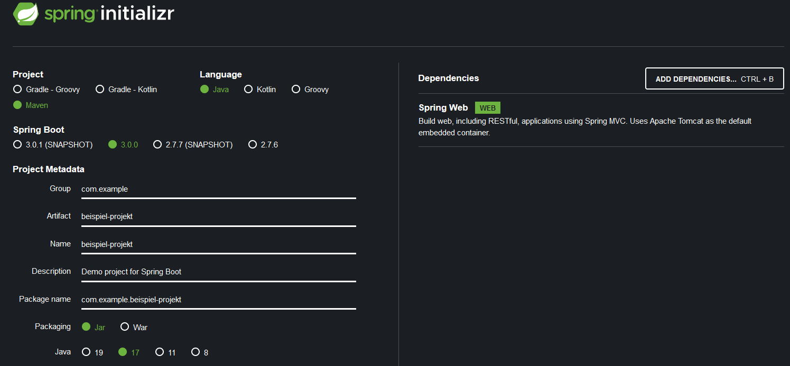

# Spring Boot Anfängerkurs

Der Link zum Tutorial: [Youtube Tutorial](https://www.youtube.com/watch?v=FdXDtLJgS9w)

## Spring Initializer

Der Link zum [Spring Initializer](https://start.spring.io/)

Über den Initializer kann man das Projekt definieren (man kann es auch über Intellij Ulitmate machen). Hier ein Bespiel Screenshot einer vorgefertigten Version:



Nun wird das erstellte Projekt heruntergeladen und anschließend entpackt und in ein Verzeichnis nach Wahl verschoben. In einer IDE nach Wahl wird das eben entpackte Projekt geöffnet.

!Achtung kleiner Bug entdeckt! -> Beim Öffnen in der IDE (Intellij) kam ein Fehler. Es konnte das Plugin nicht erkennen. Mit dem Hinzufügen der Version des Plugins unterhalb der ArtifactId des Plugins, konnte weiter gearbeitet werden `<version>${project.parent.version}</version>`. Nach dem Einfügen konnte man es wieder löschen. 

Mit dem Starten des Programms über die main-Methode kann man über den Port mit localhost:8080 die funktionierende (in diesem Fall noch nicht funktionierende) Website aufmachen:


## HTTP Request

In einem eigenen Package `controller` wird ein Controller hinzugefügt `HelloWorldController`. Es wird eine Annotation `@RestController` über der erstellten Klasse angefügt. 

```java
package com.example.beispielprojekt.controller;

import org.springframework.web.bind.annotation.RestController;

@RestController //Annotation
public class HelloWorldController {
}
```

Diese Annotation gibt der Klasse die Möglichkeit verschiedene Pfade in der URL zu erkennen und Daten zurück zu senden. Dafür muss man der Klasse zuerst sagen auf welche Pfade er reagieren soll. Es wird ein `GetMapping` erzeugt (Annotation) mit dem entsprechenden Pfad. Unter der neuen Annotation muss man eine Methode angeben. 

```java
@GetMapping("/hallo")
    public String helloWorld(){
        return "hello world";
    }
```

Über die URL: *localhost:8080/hallo* kann man nun auf die entsprechende Website zugreifen. 


Ein Ablauf wie so ein HTTP Request unter Java funktioniert: 

- Client sendet ein Request (GET "/hallo")
- Application Server (*Tomcat*) übernimmt den Request (Listening on Port: 8080)
- Gibt die Anfrage dann weiter an das Java Servlet -> hier wird die Anfrage (Request) dann bearbeitet
- Suche nach einem Controller im Code und die Identifizierung des Requests
- Ist die richtige Methode gefunden, so wird eine Antwort zurückgesendet.

## Java Servlet

(Gehört noch zum HTTP Request Thema) und ist eine Java Klasse die eben genau diese HTTP Requests annehmen und bearbeiten kann. Dazu brauch das Servlet eine Servlet Engine/Container. Dieses bekommt das Servlet über einen Application Server, wie zum Beispiel *Tomcat*. Die Spring Anwendung nutzt den *Dispatcher Servlet* (default), um eingehende HTTP Anfragen zu behandeln. 

## Dependency Injection

