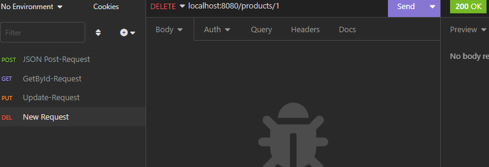

# Spring Boot Anfängerkurs

Der Link zum Tutorial: [Youtube Tutorial](https://www.youtube.com/watch?v=FdXDtLJgS9w)

## Spring Initializer

Der Link zum [Spring Initializer](https://start.spring.io/)

Über den Initializer kann man das Projekt definieren (man kann es auch über Intellij Ulitmate machen). Hier ein Bespiel Screenshot einer vorgefertigten Version:


Nun wird das erstellte Projekt heruntergeladen und anschließend entpackt und in ein Verzeichnis nach Wahl verschoben. In einer IDE nach Wahl wird das eben entpackte Projekt geöffnet.

!Achtung kleiner Bug entdeckt! -> Beim Öffnen in der IDE (Intellij) kam ein Fehler. Es konnte das Plugin nicht erkennen. Mit dem Hinzufügen der Version des Plugins unterhalb der ArtifactId des Plugins, konnte weiter gearbeitet werden `<version>${project.parent.version}</version>`. Nach dem Einfügen konnte man es wieder löschen. 

Mit dem Starten des Programms über die main-Methode kann man über den Port mit localhost:8080 die funktionierende (in diesem Fall noch nicht funktionierende) Website aufmachen:


## HTTP Request

In einem eigenen Package `controller` wird ein Controller hinzugefügt `HelloWorldController`. Es wird eine Annotation `@RestController` über der erstellten Klasse angefügt. 

```java
package com.example.beispielprojekt.controller;

import org.springframework.web.bind.annotation.RestController;

@RestController //Annotation
public class HelloWorldController {
}
```

Diese Annotation gibt der Klasse die Möglichkeit verschiedene Pfade in der URL zu erkennen und Daten zurück zu senden. Dafür muss man der Klasse zuerst sagen auf welche Pfade er reagieren soll. Es wird ein `GetMapping` erzeugt (Annotation) mit dem entsprechenden Pfad. Unter der neuen Annotation muss man eine Methode angeben. 

```java
@GetMapping("/hallo")
    public String helloWorld(){
        return "hello world";
    }
```

Über die URL: *localhost:8080/hallo* kann man nun auf die entsprechende Website zugreifen. 


Ablauf wie ein HTTP Request unter Java funktioniert: 

- Client sendet ein Request (GET "/hallo")
- Application Server (*Tomcat*) übernimmt den Request (Listening on Port: 8080)
- Gibt die Anfrage dann weiter an das Java Servlet -> hier wird die Anfrage (Request) dann bearbeitet
- Suche nach einem Controller im Code und die Identifizierung des Requests
- Ist die richtige Methode gefunden, so wird eine Antwort zurückgesendet.

## Java Servlet

(Gehört noch zum HTTP Request Thema) Ist eine Java Klasse die eben genau diese HTTP Requests annehmen und bearbeiten kann. Dazu brauch das Servlet eine Servlet Engine/Container. Dieses bekommt das Servlet über einen Application Server, wie zum Beispiel *Tomcat*. Die Spring Anwendung nutzt den *Dispatcher Servlet* (default), um eingehende HTTP Anfragen zu behandeln. 

## Application Context (anschauen)


## Dependency Injection

Ist einer der wichtigsten Sachen bei Spring -> hilft bei der Struktur des Codes (automatisch) und soll so Abhängigkeiten lösen.

Dependency = Abhängigkeit und sollte in der Programmierung vermieden werden. 

Entkoppelung durch: 

- Interfaces und abstrakte Klassen
- Keine feste Implementierung im Code (weg lass vom `new` Keyword) 

`@Autowired` ist eine der wichtigsten Annotationen in Spring und löst das Problem der festen Implementierung (dynamische Programmierung). Es wird automisch über den ApplicationContext die richtige Klasse eingefügt. Man kann demnach im Code nur mit den jeweiligen Interfaces arbeiten. Das ganze nennt sich **Inversion of Control**, dass heißt die Allokation von Klassen Instanzen wird einer dritten Partei überlassen (Spring Application Context). 

Vorteile von Dependency Injection: 

- Entkoppelung
- Weniger Code
- Testen wird vereinfacht durch "Mocks" (Dummy Daten)

## Bean

Beans sind Objekte die von der Spring **Inversion of Control** verwaltet werden.

Es gibt verschiedene Varianten den Bean mitzugeben. Viele Klassen aus Spring sind bereits Beans ohne diese zu annotieren (zum Beispiel beim RestController). Will man einen Bean bewusst erstellen, so kann man das mit der Annotation `@Component`, oder zum Beispiel über eine `@Configuration` Klasse die einen `@Bean` beinhaltet.

Sollte es zu Konflikten kommen (wenn Spring nicht mehr weiß welche Klasse es instanziieren muss) und mehr Beans übergeben wurden, die vom gleichen Typ implementiert worden sind, dann annotiert man mit `@Primary Bean` die bevorzugte Variante, damit diese den Vorrang bekommt (gibt durchaus andere Möglichkeiten). Eine weiter Möglichkeit um präziser den Bean anzugeben ist die Nutzung des `@Qualifier` (meistens mit einer ID verbunden). 

## Spring Boot Data

**JDBC**: ist die Datenschnittstelle für Java mit der es möglich ist SQL Anfragen an die Datenbank zu senden. Der Nachteil hierbei ist, dass zwei Sprachen benutzt werden müssen (SQL und Java).

**JPA**: "Java Persistence API" -> vereinfacht die Kommunikation mit Datenbanken, indem nur Java Code benutzt werden kann. Objektorientiertes Mapping wird automatisch eine Tabelle in der Datenbank erzeugt. Gleiches gilt für Datenbankanfragen, hier werden aus Methoden fertige SQL-Statements generiert (das ganze geschieht mit der **JPA Query Language** -> intuitiv mit findBy... als keyword). 

**Hibernate**: ist die Library die das JPA Standard implementiert. 

Der Ablauf sieht wie folgt aus:

- Die Anwendung (Spring Boot) verwendet mittels Hibernate das JPA Standard
- Hibernate kann Datenbank Informationen abrufen und speichern
- Die Hibernate Library erstellt aus unseren Klassen dann SQL-Anfragen
- Die Verbindung zur Datenbank geschieht dann mit dem JDBC Driver

## Abschlussprojekt des Tutorials (REST API Projekt)

[Das Abschlussprojekt (Rest Api Projekt)]()

Es wird eine CRUD-API implementiert, dafür macht man sich über den Spring Initalizer ein neues Projekt mit entsprechenden Dependencies (Spring Web, JPA, eine Datenbank -> h2). Danach werden die application properties richtig eingestellt (Datenbank). Erstellung einer Domänenklasse, Repository und einer Controller Klasse. Dabei liegt der Fokus auf die CRUD-Methoden, über den RestController.

```java
@RestController
@RequestMapping("/products")
public class ProductController {
    @Autowired
    ProductRepository productRepository;

    @PostMapping("")
    public void createProduct(@RequestBody Product product){
        productRepository.save(product);
    }
```

Mit Hilfe einer graphischen Oberfläche (z.B Insomnia) werden die Anfragen an die Datenbank ausgeführt. 


